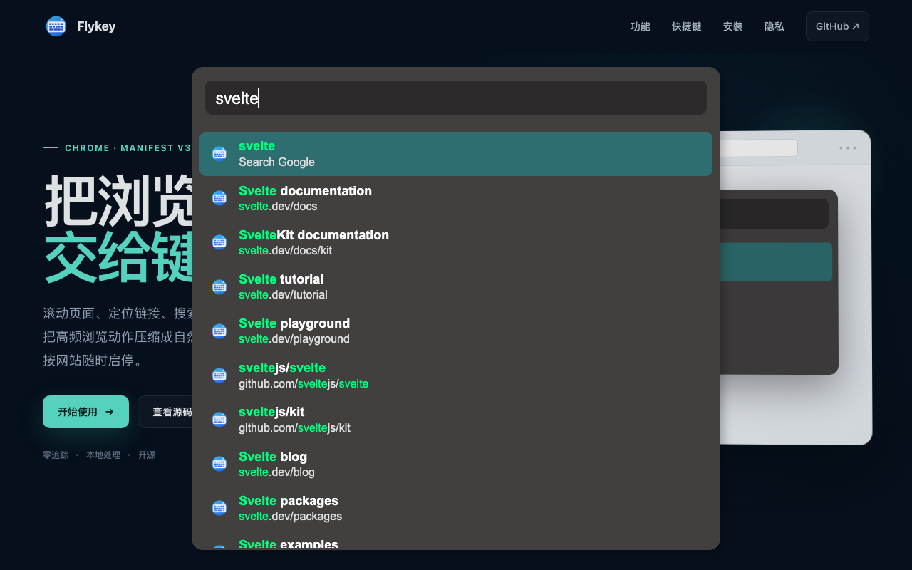
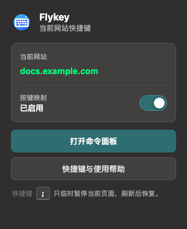

<div align="center">
  
  <h1>Flykey</h1>
  <p><strong>把浏览器交给键盘。</strong></p>
  <p>用 Vim 风格快捷键滚动网页、定位链接、搜索历史、管理标签页和书签。</p>
  <p>
    <a href="https://chromewebstore.google.com/detail/flykey/ajmlimcpgjabfaodkdgmpkiipjbhpbag">Chrome 网上应用店</a> ·
    <a href="website/index.html">产品网站</a> ·
    <a href="#安装">安装</a> ·
    <a href="#快捷键">快捷键</a> ·
    <a href="PRIVACY.md">隐私政策</a>
  </p>
  <p>
    
    
    
    
  </p>
</div>



Flykey 是一个轻量的 Manifest V3 Chrome 扩展。它在普通网页上提供一套键盘优先的导航方式，并通过封闭的 Shadow DOM 隔离界面，减少与宿主网站样式和脚本的冲突。

## 特性

- **Vim 风格导航**：使用 `j`、`k`、`gg`、`G` 等熟悉按键滚动和跳转。
- **链接提示**：按 `f` 为当前可点击元素生成短标签，无需鼠标即可打开链接。
- **历史搜索**：按 `o` 搜索最近访问的网页，或直接搜索 Google、GitHub、YouTube 等站点。
- **标签页管理**：切换、创建、关闭和恢复标签页，操作只作用于当前窗口。
- **输入模式感知**：聚焦输入框时自动让出按键，按 `Esc` 回到普通模式。
- **按网站开关**：点击工具栏图标，可立即启用或停用当前网站的按键映射。
- **正文朗读**：优先朗读选中文本；未选中时朗读页面正文中当前可见区域的文字，不修改原网页 DOM。
- **隐私优先**：无分析 SDK、无广告、无远程账号；历史记录只在本地内存中筛选。
- **发布级工程链路**：静态检查、自动测试、生产构建和最小化 ZIP 打包一条命令完成。

## 安装

### 从 Chrome 网上应用店安装

打开 [Flykey 商店页面](https://chromewebstore.google.com/detail/flykey/ajmlimcpgjabfaodkdgmpkiipjbhpbag)，点击“添加至 Chrome”。

### 从源码安装

要求 Node.js 20.19 或更高版本：

```bash
git clone https://github.com/leafOfTree/flykey.git
cd flykey
npm install
npm run build
```

然后：

1. 打开 `chrome://extensions`。
2. 开启右上角“开发者模式”。
3. 点击“加载已解压的扩展程序”。
4. 选择 Flykey 项目根目录。

修改源码后重新执行 `npm run build`，再在扩展管理页面点击“重新加载”。

### 生成发布包

```bash
npm run package
```

发布包生成到 `release/flykey-<version>.zip`。命令会自动完成静态检查、构建、测试和 ZIP 生成。

## 快捷键

快捷键只在普通模式下生效。聚焦输入框会自动进入输入模式；按 `Esc` 返回普通模式；按 `;` 可以临时暂停或恢复 Flykey。

| 按键 | 操作 | 按键 | 操作 |
| --- | --- | --- | --- |
| `j` / `k` | 向下 / 向上滚动 | `gg` / `G` | 页面顶部 / 底部 |
| `f` | 显示链接提示 | `F` | 当前视频全屏 |
| `i` | 聚焦可见输入框 | `o` | 打开搜索面板 |
| `r` / `gr` | 刷新页面 / 重新加载扩展 | `w` / `e` | 后退 / 前进 |
| `gh` / `gu` | 根路径 / 上一级 | `[` / `]` | 上一页 / 下一页 |
| `t` | 新建标签页 | `h` / `l` | 上一个 / 下一个标签页 |
| `d` / `u` | 关闭 / 恢复标签页 | `gx` | 关闭其他非固定标签页 |
| `b` | 收藏当前页面 | `y` / `Y` | 复制 URL / 标题 |
| `s` | 朗读选区或可见正文；再次按下结束 | `;` | 暂停或恢复快捷键 |
| `\` | 切换 GitHub 文件显示 | `?` | 打开快捷键与使用帮助 |

### 搜索前缀

| 前缀 | 搜索目标 | 示例 |
| --- | --- | --- |
| `h ` | GitHub | `h svelte` |
| `c ` | GitCode | `c vue` |
| `s ` | Stack Overflow | `s chrome extension` |
| `y ` | YouTube | `y keyboard workflow` |
| `w ` | Wikipedia | `w browser extension` |
| `l ` | localhost 端口 | `l 5173` |

`Enter` 在新标签页打开结果，`Ctrl/Cmd + Enter` 在当前标签页打开。

### 当前网站设置

点击 Chrome 工具栏中的 Flykey 图标，通过“按键映射”开关启用或停用当前网站。停用后，当前标签页的扩展图标会显示小型 `off` 徽标；重新启用后自动清除。设置按域名保存在浏览器本地，并会立即同步到当前页面；工具栏弹窗中的“打开命令面板”和“快捷键与使用帮助”按钮可快速进入对应功能。普通模式下按 `?` 也能直接打开内置帮助页。

按 `;` 只会临时暂停当前页面，刷新后恢复；需要长期停用某个网站时，请使用工具栏开关。



## 开发

```bash
# 安装依赖
npm install

# 监听扩展前端源码
npm run dev

# 静态检查、生产构建和测试
npm run verify

# 生成 Chrome Web Store ZIP
npm run package
```

### 静态网站

官网是 `website/` 目录中的零依赖静态站点，可以直接部署到任意静态托管服务。本地预览：

```bash
npm run site:dev
```

然后访问 `http://127.0.0.1:4173`。网站包含响应式导航、可交互命令面板演示、快捷键筛选和公开隐私政策页面。

## 项目结构

```text
flykey/
├── common/               # MV3 service worker 与消息协议
├── popup/                # 工具栏网站开关与命令入口
├── frontend/src/         # Svelte 内容脚本和 Shadow DOM 界面
│   ├── command/          # 搜索、排序和高亮逻辑
│   ├── extensions/       # 页面增强功能
│   └── lib/              # Chrome API、键盘与 UI 工具
├── icon/                 # 扩展图标及矢量源文件
├── help/                 # 内置快捷键与使用帮助页
├── scripts/              # 发布打包与网站预览脚本
├── store-assets/         # Chrome Web Store 图像素材
├── tests/                # Manifest、搜索和 service worker 测试
├── website/              # 可直接部署的静态官网
└── manifest.json         # Chrome Manifest V3 配置
```

## 权限说明

| 权限 | 用途 |
| --- | --- |
| `history` | 用户打开命令面板时读取本地历史并在内存中筛选 |
| `bookmarks` | 用户主动按 `b` 时添加书签 |
| `sessions` | 用户主动按 `u` 时恢复最近关闭的标签页 |
| `favicon` | 为历史搜索结果显示 Chrome 提供的网站图标 |
| `clipboardWrite` | 复制当前页面 URL 或标题 |
| `activeTab` | 点击工具栏图标后识别当前网站并打开该标签页的命令面板 |
| `storage` | 在 Chrome 本地保存用户选择停用 Flykey 的网站域名 |
| `<all_urls>` | 在普通网页上提供键盘导航；Chrome 内部页面无法注入 |

Flykey 不会把浏览历史或页面内容发送给开发者或第三方服务器。详情参见 [隐私政策](PRIVACY.md)。

## 发布

Chrome Web Store 提交所需的权限文案、隐私披露和检查步骤见 [发布清单](docs/STORE_LISTING.md)。所需的 1280×800 截图和 440×280 小型宣传图已经放在 `store-assets/`。

提交问题或建议：[GitHub Issues](https://github.com/leafOfTree/flykey/issues)。
